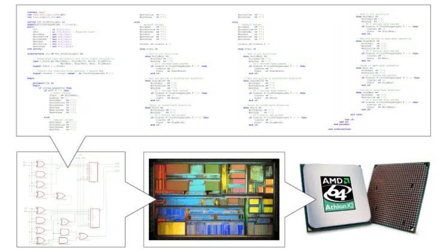
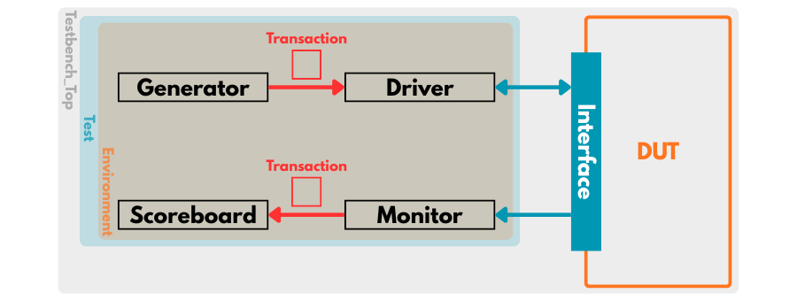
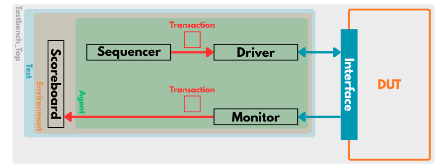

  

# Getting Started with SystemVerilog

SystemVerilog (SV) is an extension of Verilog designed for RTL design and verification. It combines hardware description and verification features, making it widely used in ASIC and FPGA design, simulation, and functional verification.

## Why SystemVerilog

SystemVerilog enhances traditional Verilog with advanced features for both **design** and **verification**:

- Improved data types and structures (`logic`, `enum`, `struct`, `union`).
- Object-Oriented Programming (OOP) for testbench development.
- Assertions and coverage for functional verification.
- Dynamic, associative, and queue-based arrays.
- Integrated support for verification methodologies like **UVM**.

## Key Differences Between Verilog and SystemVerilog

| Feature      | Verilog                  | SystemVerilog                               |
| :----------- | :----------------------- | :------------------------------------------ |
| Data Types   | reg, wire, integer, real | logic, bit, byte, int, struct               |
| OOP          | NO                       | Supports classes, inheritance, polymorphism |
| Arrays       | Static only              | Dynamic, associative, queues                |
| Assertions   | NO                       | Supports assertions                         |
| Verification | Manual                   | Automated with UVM                          |

## Data Types: Verilog vs SystemVerilog

### Verilog

Verilog is a **4-state language** because it represents hardware behavior more accurately by propagating unknown (`X`) and high-impedance (`Z`) states.

| Data Type | Nature  | No. of Bits & Default Value | Characteristic of Data Type |
| :-------- | :------ | :-------------------------- | :-------------------------- |
| wire      | 4-state | 1'bZ                        | unsigned                    |
| reg       | 4-state | 1'bX                        | unsigned                    |
| integer   | 4-state | 32'bX                       | signed                      |
| time      | 4-state | 64'bX                       | -                           |
| real      | 2-state | 0.0                         | floating-point              |

### SystemVerilog

SystemVerilog introduces **2-state data types** to improve simulation performance by removing `X` and `Z` states where unnecessary.

| Data Type | Nature  | No. of Bits & Default Value | Characteristic of Data Type |
| :-------- | :------ | :-------------------------- | :-------------------------- |
| logic     | 4-state | 1'bX                        | unsigned                    |
| bit       | 2-state | 1'b0                        | unsigned                    |
| byte      | 2-state | 8'b0                        | signed                      |
| shortint  | 2-state | 16'b0                       | signed                      |
| int       | 2-state | 32'b0                       | signed                      |
| longint   | 2-state | 64'b0                       | signed                      |
| time      | 4-state | 32'bX                       | -                           |
| shortreal | 2-state | 0.0                         | floating-point              |

## SystemVerilog Testbench Architecture

SystemVerilog provides an advanced, object-oriented approach for building testbenches that verify the functionality of a Design Under Test (DUT).

A typical SystemVerilog testbench is composed of modular components, each serving a specific role in generating, driving, and verifying data.

| Component   | Description                                                                                                                          |
| :---------- | :----------------------------------------------------------------------------------------------------------------------------------- |
| Generator   | Produces input stimulus or test vectors to drive the DUT. It can create random or constrained-random data for comprehensive testing. |
| Driver      | Retrieves transactions from the generator and drives the corresponding signals to the DUT through the interface.                     |
| Interface   | Defines a set of signals and methods that connect the DUT and the testbench, simplifying connectivity and reusability.               |
| Monitor     | Passively observes DUT signals (inputs and outputs) to capture real-time behavior and transactions.                                  |
| Scoreboard  | Compares the DUT's actual outputs with expected results, detecting functional mismatches or design bugs.                             |
| Environment | Serves as a container that instantiates and connects all verification components (generator, driver, monitor, scoreboard).           |
| Test        | Controls simulation execution and test configuration, creating the environment and initiating the verification sequence.             |

## UVM Testbench Architecture

The **Universal Verification Methodology** (UVM) builds upon SystemVerilog’s object-oriented and constrained random features.

It standardizes the structure of verification environments, promoting reusability, scalability, and consistency across projects.

| Component             | Description                                                                                              |
| :-------------------- | :------------------------------------------------------------------------------------------------------- |
| Sequence / Sequencer  | Generates transactions in a controlled sequence and sends them to the driver.                            |
| Driver                | Converts high-level transactions into pin-level activity on the DUT interface.                           |
| Interface             | Groups DUT signals and provides task/function hooks for drivers and monitors to drive or sample signals. |
| Monitor               | Collects transactions from the DUT interface and sends them for checking or coverage analysis.           |
| Scoreboard            | Performs result checking by comparing DUT outputs with expected results or reference models.             |
| Agent                 | Groups the driver, monitor, and sequencer together for modular, reusable communication blocks.           |
| Environment (uvm_env) | Top-level verification container that holds agents, scoreboards, and coverage collectors.                |
| Test (uvm_test)       | Defines and configures the environment, controlling simulation flow and test objectives.                 |

## Recommended Tools

To write, simulate, and debug SystemVerilog code, you can use the following tools:

- **ModelSim / QuestaSim** – For simulation and waveform analysis.
- **Vivado (Xilinx) / Quartus (Altera)** – For FPGA synthesis and simulation.
- **Synopsys VCS** – For ASIC design and verification.
- **EDA Playground** – A free, online platform for quick simulation.

## Used Tools

To run and simulate SystemVerilog code, you will need the following tools. Below are links to install them:

- **ModelSim**: A logic simulation tool - [Download link](https://www.intel.com/content/www/us/en/software-kit/660907/intel-quartus-prime-lite-edition-design-software-version-20-1-1-for-windows.html):

  - Select: **Individual Files**
  - Under **Intel® Quartus® Software**, download: **ModelSim-Intel® FPGA Edition (includes Starter Edition)**

- **Quartus Prime Lite**: An FPGA synthesis / implementation tool - [Download link](https://www.intel.com/content/www/us/en/software-kit/825278/intel-quartus-prime-lite-edition-design-software-version-23-1-1-for-windows.html):

  - Select: **Individual Files**
  - Under **Intel® Quartus® Software**, download: **Quartus® Prime (includes Nios II EDS)**

- **MAX10 Device Files**: MAX10 FPGA device information - [Download link](https://www.intel.com/content/www/us/en/software-kit/825278/intel-quartus-prime-lite-edition-design-software-version-23-1-1-for-windows.html):

  - Select: **Individual Files**
  - Under **Devices**, download: **MAX® 10 FPGA device support**

Place all the downloaded files in the same directory, then launch `Quartus Prime Lite` and `ModelSim` to begin your workflow.

## How to Use Simulation Tools

Once you have installed **ModelSim** and **Quartus Prime Lite**, you can follow the guides below to learn how to set up and run simulations:

- **Using ModelSim**: [Step-by-step guide](./Projects/ModelSim/README.md)
- **Using Quartus Prime Lite**: [Step-by-step guide](./Projects/Quartus/README.md)

These guides cover how to:

- Set up a SystemVerilog project
- Write and compile testbenches
- Run simulations and analyze waveforms
